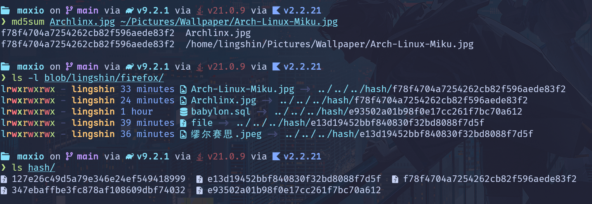
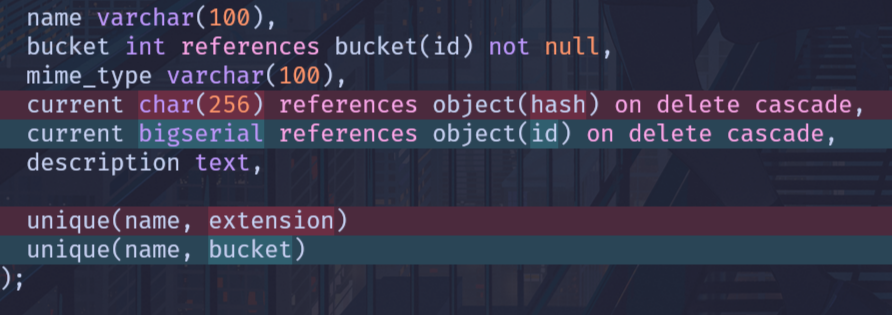
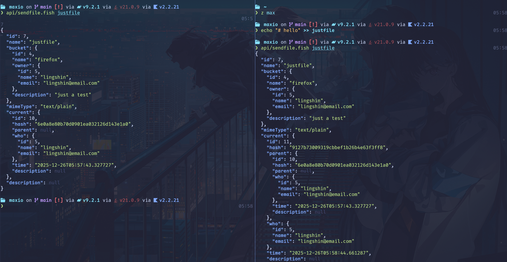

# React + Vite

This template provides a minimal setup to get React working in Vite with HMR and some ESLint rules.

Currently, two official plugins are available:

- [@vitejs/plugin-react](https://github.com/vitejs/vite-plugin-react/blob/main/packages/plugin-react) uses [Babel](https://babeljs.io/) (or [oxc](https://oxc.rs) when used in [rolldown-vite](https://vite.dev/guide/rolldown)) for Fast Refresh
- [@vitejs/plugin-react-swc](https://github.com/vitejs/vite-plugin-react/blob/main/packages/plugin-react-swc) uses [SWC](https://swc.rs/) for Fast Refresh

## React Compiler

The React Compiler is not enabled on this template because of its impact on dev & build performances. To add it, see [this documentation](https://react.dev/learn/react-compiler/installation).

## Expanding the ESLint configuration

If you are developing a production application, we recommend using TypeScript with type-aware lint rules enabled. Check out the [TS template](https://github.com/vitejs/vite/tree/main/packages/create-vite/template-react-ts) for information on how to integrate TypeScript and [`typescript-eslint`](https://typescript-eslint.io) in your project.

## Object

上次报告之后，我们修改了一下数据库

原先的 Object 变成了 File + Object 两个表

```sql
create table file (
  id serial primary key,
  name varchar(100),
  bucket int references bucket(id) not null,
  mime_type varchar(100),
  current bigint references object(id),
  description text,

  unique(name, bucket)
);
```

file 表只用来记录文件名，文件的 mime 类型，和所在的 bucket
以及目前所指向的对象

```sql
create table object (
  id bigserial primary key,
  hash char(32) not null,
  parent bigint references object(id) on delete set null ,
  file int references file(id) on delete cascade not null,
  who int references users(id) on delete cascade not null,
  time timestamp without time zone default current_timestamp not null,
  description text
);
```

object 表则用来记录 hash 值，所属的文件，父对象（即修改前的对象），以及修改者和修改时间

上传时，使用的地址是 `blob/{owner}/{bucket}/{filename}`

这用起来很像那种 git 仓库托管平台，我觉得很好

但实际上文件会被保存在 `hash/{hash}` 里面



可以看到 Archlinux.jpg 的检验和是 `f78f47`

而 `storage/lingshin/firefox` 里面有五个符号链接，
其中 `Arch-Linux-Miku.jpg` 和 `Archlinux.jpg` 指向的是同一个目标文件

符号链接使用了相对路径  
这样，只要 `storage/` 和 `hash/` 处理相同的目录下，移动到哪里都可以正常访问

而且符号链接相比硬链接还有一个好处：  
符号链接是可以跨文件系统和分区的  
`blob/` 和 `hash/` 就算不在同一个硬盘下都没有关系，
我可以把备用的硬盘挂载到 `hash/` 上而 `blob/` 不变，
依然可以正常通过 `blob/` 访问对应 hash 值的文件，
甚至不需要复制

> [!TIP]
> 关于为什么叫 firefox，  
> 因为我之前测试用的 team/group 叫 mozilla  
> 这是个很著名的开源组织
> 然后他们最知名的作品就是 firefox 了

## 上传流程

上传时需要告诉服务端这个文件的 hash 值  
如果已经存在有以这个 hash 值命名的文件的话，  
就确认一下这个文件的校验和是否和文件名一致

如果不一致，则说明这个文件还不完整，就告诉客户端这个文件目前的长度，让客户端续传，
客户端上传时根据服务端告诉的长度，设置 `Upload-Offset`

> [!TIP]
> 也不一定是文件目前的长度，可以超出文件一段距离，两段距离，实现并行上传，
> 不过我们没有测试这个功能是否可行，而且大家网络上行速率也不高，感觉没什么用

如果一致，就只需要修改一下对应 file 表的 current 列，再重新设置一下软链接
然后插入一行 object，其 Parent 为这个 file 之前的 current

## Parent

除了文件的第一个 Object 以外，所有 Object 都有一个 Parent，表示之前的版本  
由于是多对一的关系，所以会形成一个树状图的修改历史  
不过前端还没来得及做出来

如果是纯文本文件的话，还可以用 `diff` 或者 `delta` 之类的工具来和 Parent 对比增删的情况

像这样



只要修改一下 file 的 current 列，就可以实现版本回退了  
当然，也可以在 GET 的时候加上 hash 值的前几位来获取对应版本的文件

有点像 git 对吧，就是一边想着 git 一边做的

## CLI

因为前端那边没有做好，  
平时在用的 http 文件也没法很方便地自动化处理生成 hash 值的问题  
于是简单做了一个命令行的文件上传工具  
可以看到的确是有 parent 的……



没了，我们组进度怎么这么慢

天天折腾些没用的东西
